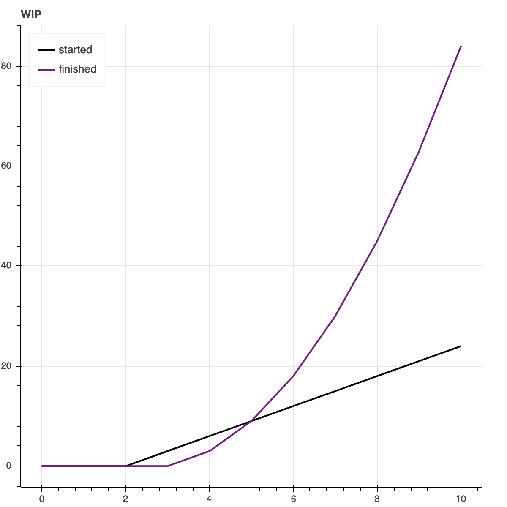
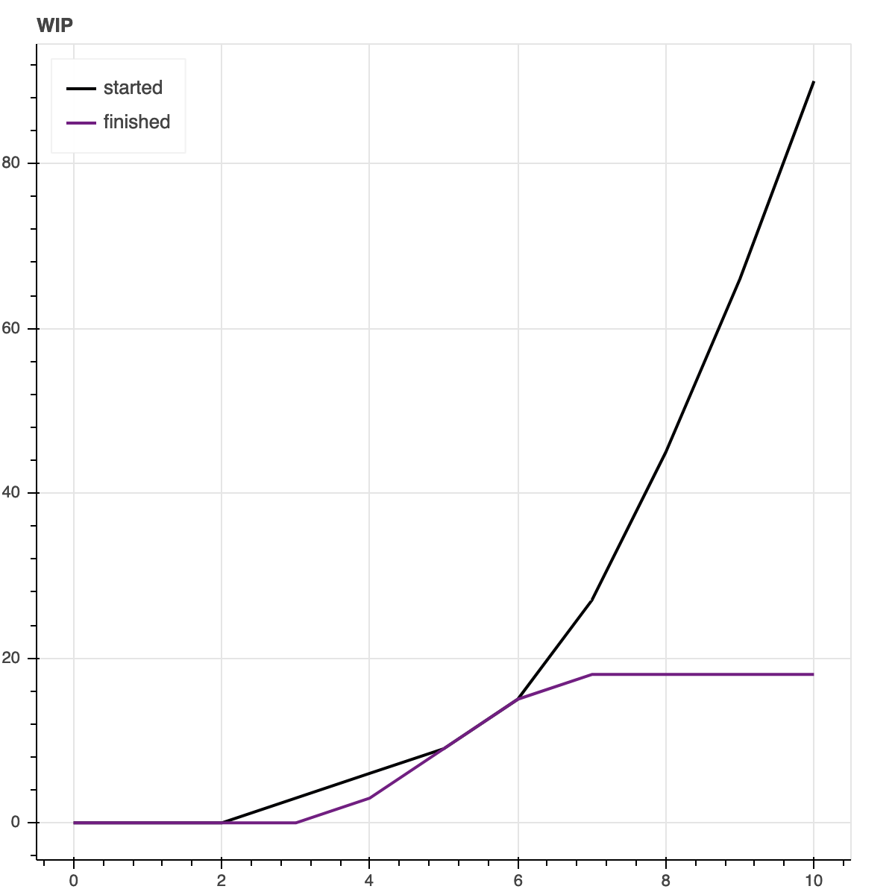
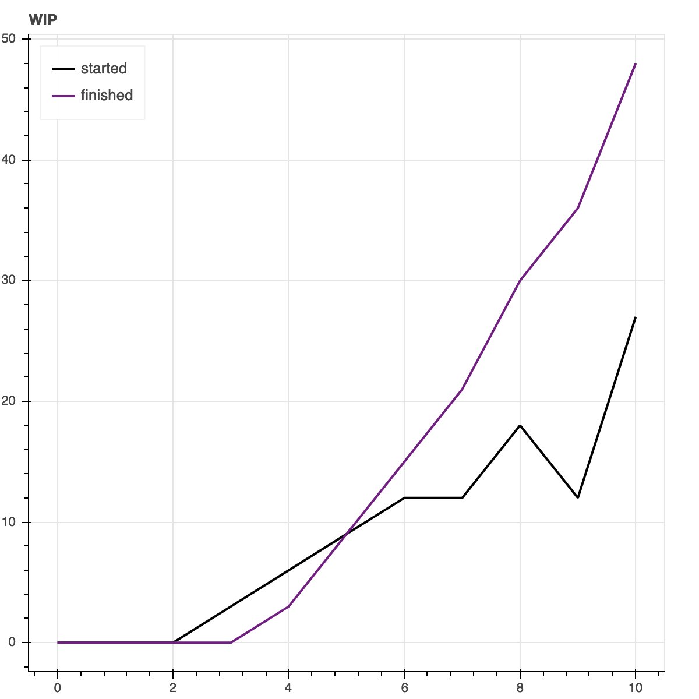

> **Update**: This post was trending on Hackernews in April 2021. See the
> [discussion][5].

In many organizations today there is one thing that almost always is true: there
are too many things done in parallel, there is too much *work-in-progress*,
everyone is busy but nothing gets done. If this is so ubiquitous why is no one
doing anything about it? Are people not aware or do they not know how to fix it?
This is so predominant, that it almost is too easy to just claim:



One aspect I keep getting back to is the notion of software engineering
organizations as production lines. As engineer I certainly refused this notion
because software engineering is *creative* work, not repetitive moves in an
assembly line. But the analogies made in [The Phoenix Project][0] and [The
Unicorn Project][1] are way too convincing. Having gone through what in
hindsight almost feels like a text book example of a manager applying
**exactly** [The Phoenix Project][0] I come to believe that this is in fact the
perfect analogy. Today, I fundamentally believe that the difference between a
manager and a good manager is their level of understanding of it.

One simple blog post is surely not enough to dive into this topic. Many books
have been written on the subject by people much more experienced than I am. This
post is about an introduction to the topic, my own experience on it, and an
invitation to read more about the topic.

# Why is too much WIP bad?

The first and most important question of course is to understand that having too
much WIP is in fact bad. With too many projects in flight, the communication
between individuals increases. Decision making is getting more complex with each
additional stake-holder involved. And eventually everyone ends up working on the
topic where the fire is burning most.

I want to illustrate the issue and it's effects using [systems thinking][4] and
a little turn-based game. This is modeled using Will Larson's [Systems][3]
library and is heavily inspired by his post on [Why limiting work-in-progress
works][2].

The rules are simple: each round we put in effort in the form of development.
Ideas are turned into projects. We start, and finish them. Each transition, from
project, to started, to finished is done at a certain *rate*. The game is played
for ten rounds. In three scenarios I will demonstrate the effects of limiting
WIP.

[4]: https://thesystemsthinker.com/introduction-to-systems-thinking/

## An ideal world

In the first scenario we play the game in an ideal world. Each project can be
started and stopped within one round respectively. The *rate* by which we start
and finish projects are determined by the development effort we put in.

```
[]          > Development  @ 3
[Ideas]     > Projects     @ Development
Projects    > Started      @ Development
Started     > Finished     @ Development
```

The result can be seen here. In just ten rounds we are able to finish 84
projects. Quite remarkable.



## Projects that take longer

In reality we usually don't finish all projects in each round. Instead we have
projects move over to the next round. We model this by reducing the *finish
rate* to the difference between the development capacity and the started
projects.

What this essentially means is that we can only *finish* projects, when there is
more capacity in *development* compared to *started* projects. The result is,
that we reach a ceiling of *finished* projects, while the number of started
projects keeps increasing. We are all busy but nothing gets done! 

```
[]          > Development  @ 3
[Ideas]     > Projects     @ Development
Projects    > Started      @ Development
Started     > Finished     @ Development - Started
```

The system is so overwhelmed that it stops finishing projects. From round seven
on the system is only able to start new projects without ever finishing anything
ever after. The *started* projects are ever growing.



## Limiting WIP

The fix for this is of course to limit the number of projects we start! To do
this, we adjust the rate of *started* projects similarly to the *finish* rate.
This improves the amount of *finished* projects to 27 after ten rounds.

```
[]          > Development  @ 3
[Ideas]     > Projects     @ Development
Projects    > Started      @ Development - Started
Started     > Finished     @ Development - Started
```

We can create an even better outcome by reducing the rate of *started* projects
even more:

```
[]          > Development  @ 3
[Ideas]     > Projects     @ Development
Projects    > Started      @ Development - (2 * Started)
Started     > Finished     @ Development - Started
```

This time we are finishing 48 projects!



Reducing the number of projects started even more does not have any effect at
this point. The only way to improve the system's output is by adding more
development effort.

# Key Insights

I want to highlight two key insights here. The first one is that we can improve
the output of a team or an organization by limiting work in progress.
Fundamentally this means that we need to find the sweet spot between starting
and finishing projects. A system that rewards starting projects will inherently
fall into the trap of having too much WIP and eventually not be able to finish
anything meaningful.

The role of management and leadership is to introduce barriers into when and how
to start a new project. Additionally, celebrating finished projects that meet
the quality bar is also important. Finishing a project and handing over the
technical debt to another team means it is not finished.

The second insight is that having small batches is favorable compared to large
projects that are taken over into the next rounds. If the projects are of a size
that can be finished within an iteration, the system is able to get a lot more
done.

The larger an organization is, the more likely large projects become. More
people and teams need to align on a solution and more sign-offs are required
from different departments. Limiting the number of those large projects in
flight will have two effects: there will inherently be a higher quality bar on
the projects started and there will be more room for small batches to occur
within teams.

# Symptoms of too much WIP

In the context of a team the first indicator of too much WIP usually is that
everyone in the team is working on something different. For every engineer in
the team there is a separate task or even project. Daily stand ups are centered
around people not work. There are also very few interactions between people
during the stand up, so everyone just pushes their current status to the group.

The next obvious symptom is that everyone is busy but nothing gets done. In
Scrum or Kanban you can easily visualize this by introducing a *Waiting for
Review* state for example. Watch how it will grow over time as people are
starting new tasks before reviewing other's work.

Usually starting the next task is more important that finishing what is
basically already finished but just needs a quick *looks good to me (LGTM)*.
Another side effect of having too much WIP is a decline in the quality of work
produced. If everyone just quickly adds a *LGTM* to a PR, we miss things and
certainly do not have the code in the best possible way. Only one person has
worked on it in an opinionated way.

# Fixing WIP in real life

The practical fixes are of course not as simple as described in the models
above. How can I find out what the ideal WIP limit is for the system I am in? So
far I have started working with teams suffering from too much WIP. In those
circumstances I found it best to start radical and limit the WIP to *one*. This
can be *one* project or *one* main priority or the *one* thing we really need to
get done in the next round.

Usually it takes a team a few iterations to learn. Before they were all *busy*
and all working on many things. Now they might sometimes feel there is nothing
to do and wonder what they should do with their *free* time. It only takes a few
iterations though until collaboration within the team increases. This means
earlier feedback loops on work-in-progress. The quality of finished projects
increases which leads to a smaller number of incidents, fewer bugs, and less
*re-work*.

After a few iterations and having recorded the learnings in retrospectives, we
collectively decided to increase the WIP. This was an important step for me and
the team: we were slowly learning to work on more than one topic in parallel
while not sacrificing quality. From there on: rinse and repeat.

# Conclusion

Limiting work-in-progress is **the** tool every manager and leader needs to have
in their tool belt. This is the one super power that over time will allow moving
faster to the desired goal.

Unfortunately, most managers today are not aware of this and just keep *pushing*
their teams to work faster. And *fast* usually means working on many topics at
the same time.

It just feels good to always be busy.

[0]: https://www.goodreads.com/book/show/17255186-the-phoenix-project
[1]: https://www.goodreads.com/book/show/44333183-the-unicorn-project
[2]: https://lethain.com/limiting-wip/
[3]: https://github.com/lethain/systems

[5]: https://news.ycombinator.com/item?id=26759903
